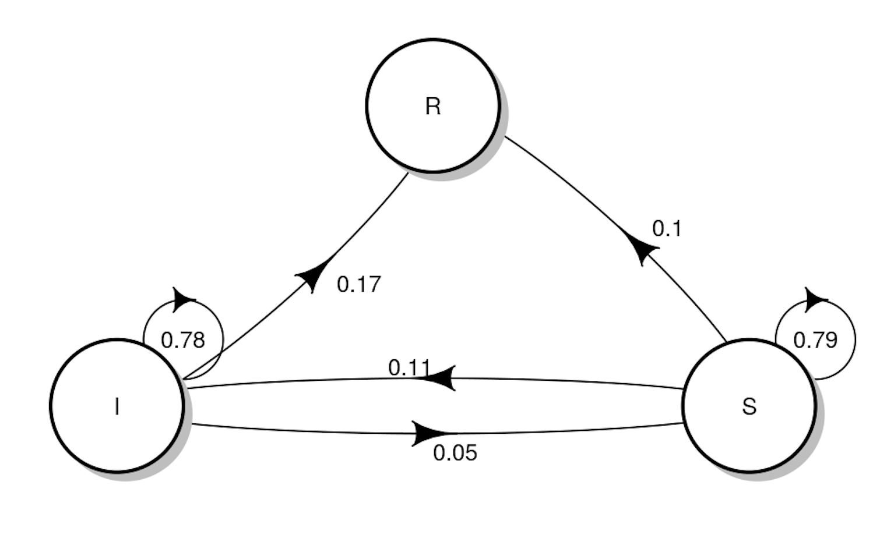

```{r setup, include=FALSE}
knitr::opts_chunk$set(echo = FALSE, 
                      warning = FALSE,
                      message = FALSE)
```

```{r bibliotecas, include=FALSE}

#rm(list = ls()) #will clear all objects includes hidden objects.
#options(rstudio.help.showDataPreview = FALSE)
# Carregando bibliotecas ---------
pacman::p_load(tidyverse, dplyr, rio, papeR, patchwork, 
               kableExtra, pROC, ExhaustiveSearch, scales,
               sjPlot, sjmisc, performance,lmtest, stringr,
               heemod, patchwork)


```

\newpage

```{=tex}
\begin{abstract}

A avaliação econômica em saúde é fundamental para orientar as decisões de alocação de recursos em sistemas de saúde, particularmente em ambientes com restrições orçamentárias, como é o caso do Sistema Único de Saúde (SUS) no Brasil. Nesse contexto, os modelos de Markov emergem como ferramentas valiosas, pois permitem representar os diferentes estados de saúde e suas respectivas transições, incluindo a incorporação de custos associados a cada estado, o que facilita significativamente a análise de custo-efetividade de tratamentos. Este estudo aplica um modelo de Markov, disponível no pacote heemod na linguagem R, para avaliar estratégias de tratamento do Transtorno Afetivo Bipolar (TAB). O pacote heemod oferece suporte tanto para modelos de Markov homogêneos e não-homogêneos, quanto para modelos semi-Markov. No caso específico deste trabalho, optamos por utilizar cadeias de Markov homogêneas, ressaltando, contudo, o potencial do pacote para abordar casos mais complexos. O foco é avaliar, de maneira simplificada, a custo-efetividade de estratégias de tratamento para o TAB, contrastando a abordagem de não tratamento com a de tratamento de primeira linha. O modelo proposto inclui quatro estados - População Geral, Pré-Sintomático, Sintomático e Morte - capturando assim a dinâmica do TAB e seu impacto indireto, mas significativo, na expectativa de vida. Os parâmetros modelados são baseados em evidências da literatura. Os resultados indicam que o tratamento medicamentoso é mais custo-efetivo, proporcionando um ganho de anos de vida para os pacientes e redução de custos totais ao longo de 40 ciclos (40 anos). A aplicação desses modelos em psiquiatria mostra-se promissora, indicando um caminho eficiente para a análise econômica em saúde mental.
\end{abstract}
```
\newpage

# Introdução e Objetivos

A avaliação econômica em saúde, cada vez mais fundamental na tomada de
decisões dos sistemas de saúde, é utilizada para determinar quais
intervenções devem ser financiadas com recursos limitados. Essencial em
decisões sobre cobertura ou reembolso de novos medicamentos, esta
abordagem foi pioneira na Austrália e em Ontário, Canadá. Atualmente é
utilizada extensivamente no Reino Unido, onde o Instituto Nacional para
Excelência em Saúde e Cuidados Clínicos (NICE) expande seu uso para
dispositivos médicos, tecnologias de diagnóstico e procedimentos
cirúrgicos \cite{briggs2006decision}.

No Brasil esse é um campo em crescimento, especialmente em vista da
necessidade de otimizar os recursos no Sistema Único de Saúde (SUS). Com
um sistema de saúde pública que enfrenta desafios de financiamento e
desigualdades regionais, a avaliação econômica torna-se crucial para
garantir a eficiência na alocação de recursos e no acesso equitativo a
tratamentos e tecnologias. Ainda há desafios, como a necessidade de
maior capacitação técnica e integração de dados de saúde, mas a
avaliação econômica está se tornando uma ferramenta cada vez mais
importante na formulação de políticas de saúde no país
\cite{scielo2009}.

Nos estudos de avaliação econômica em saúde, custos e resultados são
atribuídos a diferentes estados de saúde (como saudável, doente ou
morto) para avaliar a eficiência de várias estratégias de saúde. Esses
custos podem incluir despesas médicas ou de medicamentos, enquanto os
resultados se referem a anos de vida ou qualidade de vida. Modelos de
Markov são utilizados para representar esses estados de saúde e as
probabilidades de transição entre eles ao longo do tempo. Embora os
modelos de Markov sejam robustos, a programação de modelos
personalizados pode ser complexa. Para superar isso, o pacote heemod foi
desenvolvido na linguagem R, facilitando a criação e análise de modelos
de Markov em avaliações econômicas de saúde, tornando o processo mais
acessível e eficiente \cite{heemodpaper, heemodman}

O Transtorno Afetivo Bipolar é uma doença psiquiátrica grave e crônica,
que afeta entre 1 e 5% da população mundial \cite{scaini}.
Caracteriza-se por uma mudança sustentada de humor, com alternância
entre polos, que recebem os nomes de mania e depressão, ou leva a
estados mistos, normalmente associados a grande prejuízo funcional. A
mania é caracterizada como um estado humor elevado, expansivo ou
irritado com duração maior que uma semana associado a outros sintomas
característicos e é o principal marcador clínico diagnóstico do TAB
\cite{dsm}. Para um grupo de pessoas, a doença leva a um quadro crônico,
persistente e com curso deteriorante. Episódios recorrentes influenciam
o desfecho clínico e aumentam a vulnerabilidade individual a novos
episódios, além de reduzir a resposta ao tratamento \cite{gana}.A doença manifesta-se, geralmente, na adolescência e em adultos jovens com uma média de início de 25 anos \cite{canmat}. 

Apesar de intervenções psicológicas, sociais e ocupacionais mostrarem-se importantes para o manejo do TAB, o uso de medicações é o pilar do tratamento, sendo necessário para a condução das condições depressivas, maníacas e profiláticas contra recaídas \cite{smith}. O tratamento é feito com medicações estabilizadoras de humor, como carbonato de lítio e anticonvulsivantes, além de medicações antipsicóticas. Estima-se que o custo anual com o tratamento da condição encontre-se entre US\$1904, para quadros não complicados, a US\$33090 em condições que exijam internação e intervenções psiquiátricas mais frequentes.  

O objetivo desse trabalho foi então avaliar a custo-efetividade do
tratamento de primeira classe ou nenhum considerando a internacao...
(elaborar melhor) utilizando o pacote heemod

\newpage

# Metodologia

## Cadeias de Markov homogêneas

Segundo apresentado em \citeonline{ross} uma cadeia de Markov
tradicional é um processo estocástico em que a distribuição condicional
para qualquer estado futuro $X_{n+1}$, dados os estados passados
$X_0, X_1,...,X_{n-1}$ e o estado presente $X_n$, é idependente dos
estados passados e depende somente do estado presente . O processo
assume um número finito de possíveis valores $\{X_n, n = 0, 1, 2,...\}$
e, se $X_n = i$, considera-se que o processo está no estado **i** no
tempo **n**. Assume-se que, quando o processo está no estado **i**,
existe uma probabilidade $P_{ij}$ de ir para o estado **j** em seguida.
Isto é:

$$P\{X(n+1)=j | X_n = i_n, X_{n-1}=i_{n-1}, ..., X_1=i_1, X_0=i_0\}=P_{ij} $$
para todos os estados $i_0,i_1,...,i_{n},j$ e para todo $n \geq 0$.
valor $P_{ij}$ representa a probabildiade do processo sair de **i** e ir
para **j**.

No contexto de análise econômica em saúde, podemos representar o estado
de saúde como estados e as mudanças de saúde ao longo do tempo como
probabilidades de transição entre estados. Dessa forma, esse processo
pode ser modelado com cadeias de Markov. As probabilidades de transição
entre estados podem ser descritas por uma matriz de transição
bidimensional quadrada T, onde o elemento i,j é a probabilidade de
transição entre o estado i e j. A probabilidade de estar em um dado
estado no tempo t é dada por:

$X \times T^t$.

Figure \@ref(fig:cad) podemos observar um exemplo simples.

```{r cad, echo=F, position="H",  out.width="50%", fig.cap="Exemplo de cadeia de Markov aplicado à saúde. S pode ser um estado Saudável/Sucetível, I o estado doente/infectado e R, o estado absorvente da morte"}


```

\newpage

## Cadeias de Markov homogêneas

Uma cadeia de Markov não-homogênea é uma extensão do conceito de cadeias
de Markov homogêneas, na qual as probabilidades de transição entre
estados podem variar com o tempo. Em cadeias de Markov homogêneas, essas
probabilidades são constantes e não dependem do tempo. Já em cadeias de
Markov não-homogêneas, elas podem mudar ao longo do tempo.

Assim, seja $X(t)$ o estado de uma cadeia de Markov no tempo $t$, que
pertence a um conjunto discreto ou contínuo de pontos no tempo (por
exemplo, $( t = 0, 1, 2, \ldots )$ para cadeias de tempo discreto). A
cadeia é caracterizada por um conjunto de probabilidades de transição
que dependem do tempo, denotadas por $P_{ij}(t, t +\Delta t)$, onde:

$P_{ij}(t, t + \Delta t)$ é a probabilidade de transição do estado $i$
para o estado $j$ entre os instantes $t$ e $t + \Delta t$.

Em termos formais, para qualquer conjunto de estados $(i, j)$ e tempos
$(t, t + \Delta t)$, temos:

$P_{ij}(t, t + \Delta t) = Pr{X(t + \Delta t) = j \mid X(t) = i}$

A propriedade fundamental da cadeia de Markov, que é a falta de memória,
ainda se mantém: a probabilidade de transição para um futuro estado
depende apenas do estado atual, e não da história da cadeia. No entanto,
em cadeias não-homogêneas, como as probabilidades de transição podem
mudar com o tempo, a análise dessas cadeias pode ser mais complexa do
que no caso das cadeias homogêneas.

Nos contexto de economia da saúde, os modelos de Markov não-homogêneos,
ou seja aqueles com dependência do tempo do modelo
\cite{hawkins2005cost}, também são úteis. Neses utiliza-se uma matriz de
transição tridimensional U (um *array*, ou *tensor*). Assim como na
matriz bidimensional T descrita anteriormente, os índices das primeiras
duas dimensões, i e j, representam a probabilidade de transição entre os
estados i e j. Além disso, o índice da terceira dimensão, k, corresponde
ao número de ciclos já executados pelo modelo, de modo que o elemento i,
j, k da matriz U representa a probabilidade de transição entre os
estados i e j no momento k. A probabilidade de estar em um estado
específico no tempo t é dada por uma extensão simples da Equação 1:

$\sum_{k=1}^{t} X \times Y U_k$

Essa abordagem pode ser muito útil ao se considerar o envelhecimento dos
indivíduos a cada passo/ciclo. A cada ano de vida da coorte
observada/simulada them probabilidade de morte aumentada, que pode ser
obtida/estimadas pelas tábuas de vida demográficas.

## Processo semi-Markov

Um processo semi-Markoviano é um processo é um processo a tempo
contínuo. Dessa forma se considerar t interio, ou seja a cadeia mudar em
uma unidade de tempo, t=1,2, o processo é de Markov a tempo discreto

$$
P(T_i \le t ~| j ~ a ~seguir) = F_{i,j}
$$

Note que um processo Markoviano usual:

$$F_{i,j}(t) = 
\begin{cases} 
0, & \text{se } t < 1 \text{ ( } n \geq 1\text{)} \\
1, & \text{se } t \geq 1 \text{ ( } n \geq 1\text{)}
\end{cases}$$

Segundo \citeonline{ross}, um processo estocástico $\{N(t): t \geq 0 \}$
que pode estar em qualquer um de N estados $(1, 2, ..., N)$ e, a cada
vez que entrar em um estado **i**, lá permanecer por uma quantidade de
tempo aleatória, com média $\mu_i$ e, então, ir para um estado **j** com
probabilidade $P_{ij}$ é chamado de *processo semi-markov*.
Diferencia-se de uma cadeia de Markov por, nesta última, o tempo em que
passa em cada estado antes de uma transição ser fixo.

A proporção de tempo que um processo permanece em um estado **i** é dado
por:

$$
P_i=\frac{\mu_i}{\mu_1+\mu_2+...+\mu_N}, i = 1, 2, ... , N
$$

Com $\mu_i$ representando a quantidade esperada de tempo em que um
processo permanece no estado **i** durante cada visita.

Considera-se $\pi_i$ a proporção de transições que levam o processo ao
estado **i**. $X_n$ denota o estado do processo após a n-ésima
transição. Então $\{X_n, n \geq 0\}$ é uma cadeia de Markov com
probabildades de transição $P_{ij}, i,j = 1,2,...,N$. $\pi_i$ será a
probabilidade estacionária para essa cadeia de Markov. Isto é, $\pi_i$
será a única solução não-negativa para $$\sum_{i=1}^N \pi_iP_{ij}=1\\
\pi_i=\sum_{j=1}^N \pi_jP_{ij},i=1,2,...,N 
$$ Como o processo passa um tempo esperado $\mu_i$ no estado **i**
sempre que visita aquele estado, $P_i$ dever ser uma média ponderada de
$\mu_i$, em que $\pi_i$ é poderado proporcionalmente a $\mu_i$:

$$
P_i=\frac{\pi_i\mu_i}{\sum_{j=1}^N \pi_jP_{ij}}, i=1,2,...,N
$$ e $\pi_i$ é a solução da equação anterior e a probabilidade $P_i$
para um processo Semi-Markov

De forma intuitiva, podemos o conceito de processos semi-Markov da
seguinte maneira: Imagine um processo que pode estar em um de três
estados: 1, 2 ou 3. Ele começa no estado 1, onde permanece por um tempo
aleatório com média $\mu_1$, depois passa para o estado 2 (tempo médio
$\mu_2$), e depois para o estado 3 (tempo médio $\mu_3$). Após isso,
retorna ao estado 1 e o ciclo se repete. A questão é: qual a proporção
do tempo que o processo passa em cada estado?

Para calcular isso, usamos um processo de renovação-recompensa. Aqui, a
"recompensa" é o tempo gasto em cada estado por ciclo. A proporção do
tempo em cada estado (Pi) é dada pela média de tempo no estado ($\mu_i$)
dividida pela soma das médias de todos os estados.

Em um processo semi-Markov, cada vez que o processo entra em um estado,
ele permanece lá por um tempo aleatório com média $\mu_i$, e depois faz
a transição para outro estado com uma probabilidade definida. Se o tempo
em cada estado for um valor fixo=1, o processo semi-Markov se torna uma
cadeia de Markov. A proporção de tempo em cada estado em um processo
semi-Markov também é uma média ponderada, mas levando em conta as
probabilidades de transição entre os estados.

Aplicando essa teoria no contexto de Economia da Saúde temos que nos
modelos de Markov, as transições futuras de pacientes são determinadas
sem considerar a história clínica anterior. Embora útil, esse método
pode ser limitado para doenças complexas ou tecnologias de tratamento
avançadas, onde o histórico de saúde é crucial. Para superar isso, os
modelos semi-Markov podem ser aplicados. Eles permitem incorporar a
'memória' de eventos anteriores, como a duração desde um tratamento de
câncer ou a localização de uma recorrência. Essa abordagem resulta em
modelos mais precisos e detalhados, capazes de diferenciar riscos e
qualidade de vida com base em históricos específicos de pacientes.

Na aplicação que apresentaremos, essa situação é apresentada como tempo
de estado. No pacote, o método foi implementado com o método de
"estado-túnel" \cite{hawkins2005cost}. Um estado-túnel é um estado que
pode ser ocupado por apenas 1 ciclo, ele representa ao mesmo tempo o
estado de saúde em que uma pessoa está e o número de ciclos previamente
gastos neste estado. Um estado A com dependência de tempo de estado é
expandido em $(t)$ estados-túnel $(A_1, A_2, \ldots, A_t)$ (onde $t$ é o
número total de ciclos). Por exemplo, considere a seguinte matriz de
transição:

$$
\begin{bmatrix}
P(A \to A) = f(s) & P(A \to B) = C \\ P(B \to A) & P(B \to B) 
\end{bmatrix}
$$

Onde $P(A \to B)$ é a probabilidade de transição entre o estado A e B,
$s$ o número de ciclos gastos no estado A, $f$ uma função arbitrária que
retorna uma probabilidade de transição, e $C$ o complemento de
probabilidade (1 menos a soma das probabilidades em uma linha dada).
$P(B \to A)$ e $P(B \to B)$ são probabilidades arbitrárias que não
dependem do tempo de estado.

Assim, nos modelos semi-Markov, matrizes de transição multidimensionais
são usadas para capturar a dependência temporal, permitindo que o modelo
reflita mais precisamente como o estado de saúde de um paciente muda ao
longo do tempo e em resposta a diferentes tratamentos. Esse nível de
detalhamento é particularmente útil para doenças com progressão complexa
ou tratamentos que têm efeitos variáveis ao longo do tempo, tornando os
modelos semi-Markov uma ferramenta valiosa em estudos de
custo-efetividade e na tomada de decisões em saúde.

## Descrição da questão

Será modelado o transtorno afetivo bipolar segundo uma cadeia de Markov
Homogênia. Comentaremos sobre a possibilidade de expansão para modelos
semi-Markov. Nesse modelo consideraremos duas **estratégias**:

-   Não tratamento

-   Tratamento de primeira linha conforme as diretrizes CANMAT and ISBD
    Guidelines on the Management of Bipolar Disorder.

Os estados do modelo são quatro: População Geral,Pré-Sintomático (ou com
sintomas controlados), Sintomático e Morte. Apesar de o TAB não levar à
morte diretamente, ele aumenta a chance de morte por suicídio de modo
que a expectativa de vida de uma pessoas com TAB chega a ser de 10 anos
a menos que a população geral.

Os as probabilidades de transição foram estimados a partir da
prevalência da doença na população, taxas de incidência e risco.

```{r echo=F}
library(heemod)

## PARA ILUSTRACAO DA CADEIA -----

mat_base <- define_transition(
  state_names = c("geral", "pre", "symp", "death"),

  0.949,     0.05 , 0 ,  0.001,
  0,     0.01,           0.9,   0.001, 
  0,    0.1,        0.7           ,   0.2,
  0,    0,             0,                1)

mat_med <- define_transition(
  state_names = c("geral", "pre", "symp", "death"),


  0.949,     0.05 , 0 ,  0.001,
  0,     0.01,           0.45,   0.001, 
  0,    0.7,        0.1           ,   0.2,
  0,    0,             0,                1)

```

```{r fig.show="hold", out.width="48%", fig.cap="Cadeia de Markov para as duas estratégias abordadas. Sem tratamento (esquerda) e com tratamento (direita)"}
par(mar = c(0,0,0,0))
plot(mat_base)
plot(mat_med)
```

# Resultados e Discussão

Os parâmetros da cadeia de transição foram obtidos como descrito
anteriormente, assim como o custo dos estados. Seguindo as intruções do
pacote, temos:

```{r}
library(heemod)

# APLICACAO EM TAB

# ---------------------
# Parâmetros
# --------------------
par_mod <- define_parameters(
  age_base = 20,
  age_cycle = model_time + age_base,
  p_death_all = 262828 / 214300000, #excesso de mortalidade causas naturais
  p_death_disease = 0.2, # Probabilidade de morte por suicídio em TAB
  p_death_symp = combine_probs(
     p_death_all,
     p_death_disease),
  p_disease_base = 0.9, # Probabilidade da doença na população assinto
  med_effect = 0.5 , # Efeito da medicação
  prevalencia = 0.05,
  p_disease_med = p_disease_base * med_effect , # Probabilidade recaída 
  cost_hospit_cycle = 100000  , # Custo de cada ciclo de hospitalização
  p_cured_base = 0.2,
  p_cured_med = 0.7,
  cost_med = 5000,
  dr = 0.05,
  qaly_disease = 0.5)

```

Em seguida, defini-se as matrizes, estados e estratégias.

```{r}
# ------------------------------------------------------------------------
# Transicoes
# ------------------------------------------------------------------------
mat_base <- define_transition(
  state_names = c("geral", "pre", "symp", "death"),

  C,     prevalencia, 0 ,               p_death_all,
  0,     C,           p_disease_base,   p_death_all, 
  0,    p_cured_base,        C           ,   p_death_symp,
  0,    0,             0,                1)

mat_med <- define_transition(
  state_names = c("geral", "pre", "symp", "death"),

  C,     prevalencia, 0 ,               p_death_all,
  0,     C,           p_disease_med,   p_death_all, 
  0,    p_cured_med,        C           ,   p_death_symp,
  0,    0,             0,                1)


# ------------------------------------------------------------------------
# Valores de estados
# ------------------------------------------------------------------------
# custo_medicacao - custo do tratamento
# custo_internacao - custo da internação
# custo_total - custo total
# qaly - anos de vida relacionados a saúde ajustados pela qualidade de vida
#        1 - um ano em perfeita saúde
#        0 - morte


state_geral <- define_state(
  cost_treat = 0,
  cost_hospit = 0, # good health => no hospital expenses
  cost_total = 0,
  qaly = 1)

state_pre <- define_state(
  cost_treat = dispatch_strategy(
    base = 0, # no treatment => no treatment cost
    med = cost_med),
  cost_hospit = 0, # good health => no hospital expenses
  cost_total = discount(cost_treat + cost_hospit, r = dr),
  qaly = 1)

state_symp <- define_state(
  cost_treat = 0,
  cost_hospit = cost_hospit_cycle,
  cost_total = discount(cost_treat + cost_hospit, r = dr),
  qaly = qaly_disease)

state_death <- define_state(
  cost_treat = 0,
  cost_hospit = 0,
  cost_total = 0,
  qaly = 0)

# ------------------------------------------------------------------------
# Estrategias
# ------------------------------------------------------------------------
strat_base <- define_strategy(
  transition = mat_base,
  geral = state_geral,
  pre = state_pre,
  symp = state_symp,
  death = state_death)

strat_med <- define_strategy(
  transition = mat_med,
  geral = state_geral,
  pre = state_pre,
  symp = state_symp,
  death = state_death)


```

Finalmente, ajusta-se o modelo, definindo-se a quantidade de ciclos.

```{r}
res_mod <- run_model(
  parameters = par_mod,
  base = strat_base,
  med = strat_med,
  cycles = 20,
  cost = cost_total,
  effect = qaly,
  method = "life-table")
```

Podemos observar o seguinte resultado:

```{r, fig.cap="Quarente ciclos no modelo de Markov comparando as duas estartegias"}
plot(res_mod)
```


Finalmente, podemos analisar a custo efetividade observando o gráfico.

```{r echo=F, out.width="70%", fig.cap="Relação dda diferença de Quality-ajustes life-years e de custo entre as suas estratégias."}
ggplot()+
     geom_vline(xintercept=0)+
    geom_hline(yintercept=0)+
    geom_abline(slope = 85,intercept=0, linetype="dotted")+
     geom_label(aes(x=4.127844,y=-37,label="trat"), fill="#b2df8a", size=6)+
    geom_label(aes(x=0,y=0,label="sem trat"),fill="#a6cee3", size=6)+
     scale_x_continuous(limits=c(-6,6), breaks=seq(-6,6,1)) +
     scale_y_continuous(limits=c(-500,500),breaks=seq(-500,500,100))+
  labs(x="Diferença de QALY",
       y="Diferença de Custo")+
  theme_bw(base_size = 12)
```

\newpage
# Conclusão

Este relatório ilustrou a aplicabilidade e a eficácia dos modelos de Markov na avaliação econômica em saúde, com um foco particular no Transtorno Afetivo Bipolar (TAB). Através do uso do pacote heemod na linguagem R, demonstramos como as cadeias de Markov homogêneas podem simplificar e esclarecer a análise de custo-efetividade em estratégias de tratamento. Ao comparar a não intervenção com o tratamento de primeira linha, os resultados sugerem um claro benefício no uso de medicamentos, evidenciado pelo aumento de anos de vida ajustados pela qualidade e pela redução dos custos totais ao longo de um horizonte temporal de quatro décadas. Tal benefício transcende as métricas econômicas, refletindo um potencial impacto positivo significativo na qualidade de vida dos pacientes.

Além disso, a discussão sobre a expansão potencial para modelos semi-Markov destaca a versatilidade do pacote heemod em abordar complexidades adicionais, como a progressão da doença e a história clínica dos pacientes. A aplicação desses modelos em estudos de custo-efetividade no campo da psiquiatria, particularmente, revela-se não apenas viável, mas também necessária, dada a complexidade dos padrões de tratamento e progressão da doença no TAB.

Portanto, concluímos que a modelagem de Markov representa uma ferramenta robusta e flexível, essencial para a tomada de decisões informadas em saúde pública. A incorporação desses modelos em avaliações econômicas fornece insights valiosos que podem guiar políticas de saúde, otimizar o uso de recursos e, o mais importante, melhorar os desfechos para os pacientes. A continuidade na pesquisa e no desenvolvimento de métodos avançados de modelagem, como os explorados neste relatório, é crucial para enfrentarmos os desafios da economia da saúde no Brasil e no mundo.

\newpage

# Apêndice

```{r ref.label=knitr::all_labels(), echo=TRUE, eval=FALSE}
```

\newpage